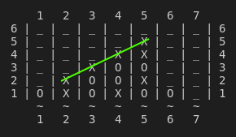
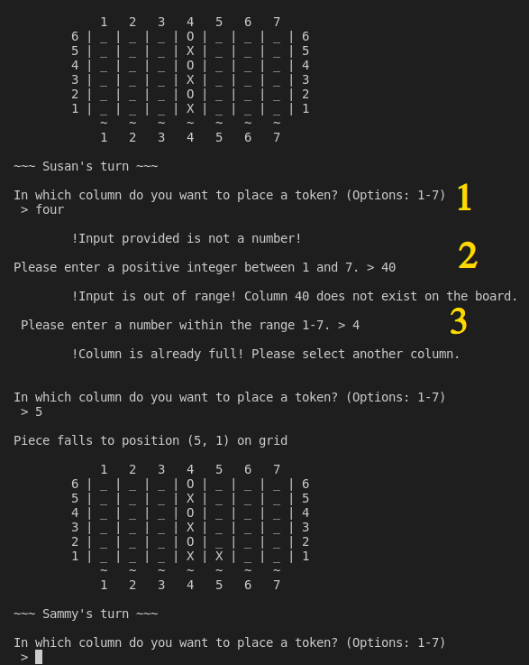

# Cuatro en Raya - Program README

## Overview

Cuatro en Raya is a computer game that adapts the classic Connect Four board game for the terminal/command-line. It can be played with two players sitting side by side or in single-player mode against a computer.

__Tags__: Connect Four, Conecta 4, Conecta Cuatro, Cuatro en Linea, 4 en Linea, Ceros y Cruces, Triqui, Juego del Gato, OXO, Four in a Row, 4 in a Row, Four Up, 4 Up, 4Up, Find 4, Find Four, Plot 4, Plot Four

## Quick Start Guide

Open your terminal and at the command line run:

1. Clone this repository to a directory on your machine locally

2. Run the in the directory

    ~~~bash
    java PlayGame <NAME> <XorO> <NAME>
    ~~~

## Classes

## Design Discussion

### Input Validation

#### In-Game
The game gracefully deals with the following types of improper player input during their move, so the game runs smoothly in the case of user-error such as misstyping (See below image illustrating each type of check):

1. Not a Number

2. Out of Range

3. Column Full

#### Game Launch 
The game is also designed to give detailed feedback when the user fails to launch the game properly, including printing to standard error (i.e., to the terminal usually) the game-launch usage/syntax instructions with examples.